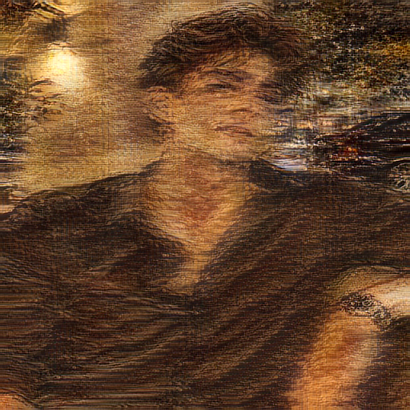

# 🎨 Neural Style Transfer (AdaIN) with PyTorch & Flask

An end-to-end Deep Learning application for **Arbitrary Real-Time Neural Style Transfer** using **Adaptive Instance Normalization (AdaIN)**, built with PyTorch and featuring an interactive Flask web UI.


---

## 🌟 Overview

Neural Style Transfer (NST) allows transferring the artistic style of one image onto the content structure of another. This repository implements **Arbitrary Style Transfer in Real-Time** based on the paper:
> **Arbitrary Style Transfer in Real-time with Adaptive Instance Normalization**  
> *Xun Huang, Serge Belongie* (ICCV 2017)

Unlike traditional optimization-based style transfer (which requires hundreds of backpropagation iterations per image), AdaIN uses a pre-trained encoder (VGG-19) to extract content and style features, applies an **Adaptive Instance Normalization** layer in feature space, and passes the aligned representation through a trained **Decoder network** to generate the stylized image instantaneously.

---

## ✨ Features

- **⚡ Real-Time Style Transfer**: Instant generation using a single forward pass through the trained Decoder.
- **🎛️ Dynamic Style Strength Control (`alpha`)**: Smoothly interpolate between original content ($\alpha = 0$) and full stylized output ($\alpha = 1.0$).
- **🌐 Interactive Web Interface**: Upload content and style images, adjust parameters, and view results live via a Flask web application.
- **🏋️ Complete Training Pipeline**: Custom PyTorch training script (`train.py`) supporting content loss and style loss balancing.
- **🚀 Pre-trained Weights Included**: Ships with ready-to-use pre-trained weights (`pretrained_decoder.pth` & `vgg_normalised.pth`).

---

## 🖼️ Visual Example

Below is a demonstration of pre-trained model style transfer output:



---

## 📁 Repository Structure

```
Neural-Style-Transfer-AdaIN/
├── app.py                      # Flask web application & endpoint routes
├── train.py                    # PyTorch training script for AdaIN Decoder
├── requirements.txt            # Python dependencies
├── procfile.txt                # Production deployment configuration (Gunicorn)
├── pretrained_decoder.pth      # Pre-trained AdaIN Decoder weights
├── vgg_normalised.pth          # Normalized VGG-19 Encoder weights
├── adain_algo.png              # Architecture workflow diagram
├── test_pretrained_output.png  # Pre-trained model inference sample
├── utils/
│   ├── models.py               # VGGEncoder & Decoder PyTorch module definitions
│   └── utils.py                # AdaIN logic, loss computation & image helpers
├── templates/
│   └── index.html              # HTML template for Flask web interface
├── static/
│   ├── css/                    # Custom styling for web UI
│   └── uploads/                # Directory for user-uploaded & generated images
└── examples/                   # Sample content and style reference images
```

---

## 🚀 Quick Start

### 1. Prerequisites

Ensure you have Python 3.8+ installed. It is recommended to use a virtual environment.

```bash
# Clone the repository
git clone https://github.com/Riyanshu-07/Neural-Style-Transfer-AdaIN.git
cd Neural-Style-Transfer-AdaIN

# Create and activate virtual environment
python -m venv venv
source venv/bin/activate  # On Windows: venv\Scripts\activate

# Install dependencies
pip install -r requirements.txt
```

### 2. Launch Web Application

Run the Flask web application locally:

```bash
python app.py
```

Open your browser and navigate to `http://localhost:5001`. Upload a content image and a style image, set your desired alpha slider value, and click **Transfer Style**!

---

## ⚙️ Training the Decoder

To train your own AdaIN Decoder from scratch or fine-tune existing weights:

1. Prepare your datasets:
   - **Content Dataset**: MS-COCO or similar photo dataset.
   - **Style Dataset**: WikiArt or art collection dataset.

2. Run `train.py`:
```bash
python train.py --content_dir path/to/content --style_dir path/to/style --epochs 10 --batch_size 8
```

---

## 🛠️ Tech Stack

- **Deep Learning Framework**: PyTorch, Torchvision
- **Web Framework**: Flask, Flask-WTF, Flask-Bootstrap
- **Image Processing**: Pillow (PIL), NumPy
- **Server**: Gunicorn / Werkzeug

---

## 📝 License

Distributed under the MIT License. See `LICENSE` for details.
